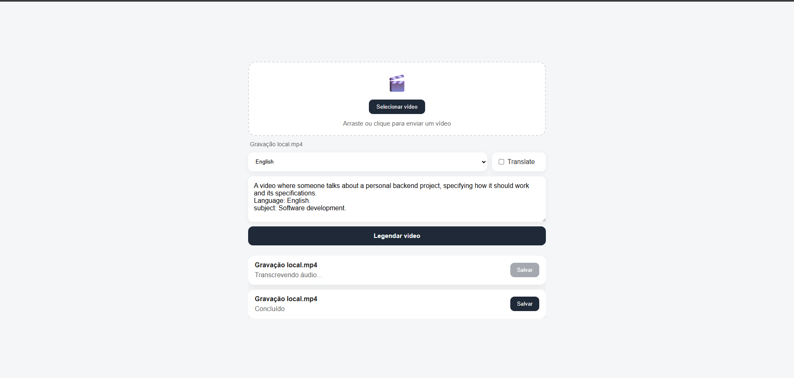

## Video Subtitle Generator

Geração automática de legendas em vídeos utilizando transcrição local com Whisper e processamento assíncrono baseado em filas.

[Vídeo demonstração](https://www.linkedin.com/posts/devistto_atualiza%C3%A7%C3%A3o-este-post-mostra-uma-vers%C3%A3o-activity-7476005008937902080-EQN5?utm_source=share&utm_medium=member_desktop&rcm=ACoAAGVn100BieRvyAMSkgzU9qUUbRemmWsneqw)

### Introdução
O objetivo deste projeto é automatizar todo o processo de legendagem de vídeos.

O usuário envia um vídeo para a API, que realiza o processamento em segundo plano através de uma fila. O sistema extrai o áudio, gera a transcrição utilizando Whisper executado localmente, cria um arquivo .srt, incorpora as legendas ao vídeo original e disponibiliza o resultado final para download.

Durante todo o processo, o cliente recebe atualizações de status em tempo real via WebSocket.



### Funcionalidades
- Upload de vídeos
- Processamento assíncrono utilizando filas
- Extração automática de áudio
- Transcrição local (áudio > texto) com Whisper
- Geração de arquivos .srt
- Inserção ("burn-in") de legendas no vídeo
- Atualização de status em tempo real
- Execução simplificada via Docker Compose

### Tecnologias
Backend
- Node.js, TypeScript, NestJS, Socket.IO 
- Redis, BullMQ, FFmpeg

Frontend
- HTML, CSS, JavaScript

Infraestrutura
- Docker, Docker Compose

#### Ferramentas
- Git, Whisper (ASR)


### Instalação
Clonar o repositório
```bash
git clone https://github.com/devistto/video-subtitle-generator.git
```
Acessar o diretório
```bash
cd video-subtitle-generator
```

Subir os containers
```bash
docker compose up --build
```

### Licença
[MIT](./LICENSE)

**Note**: Este projeto está sujeito a lisenças de dependências como [Whisper - speech-to-text](https://github.com/hwdsl2/docker-whisper#switching-models).
